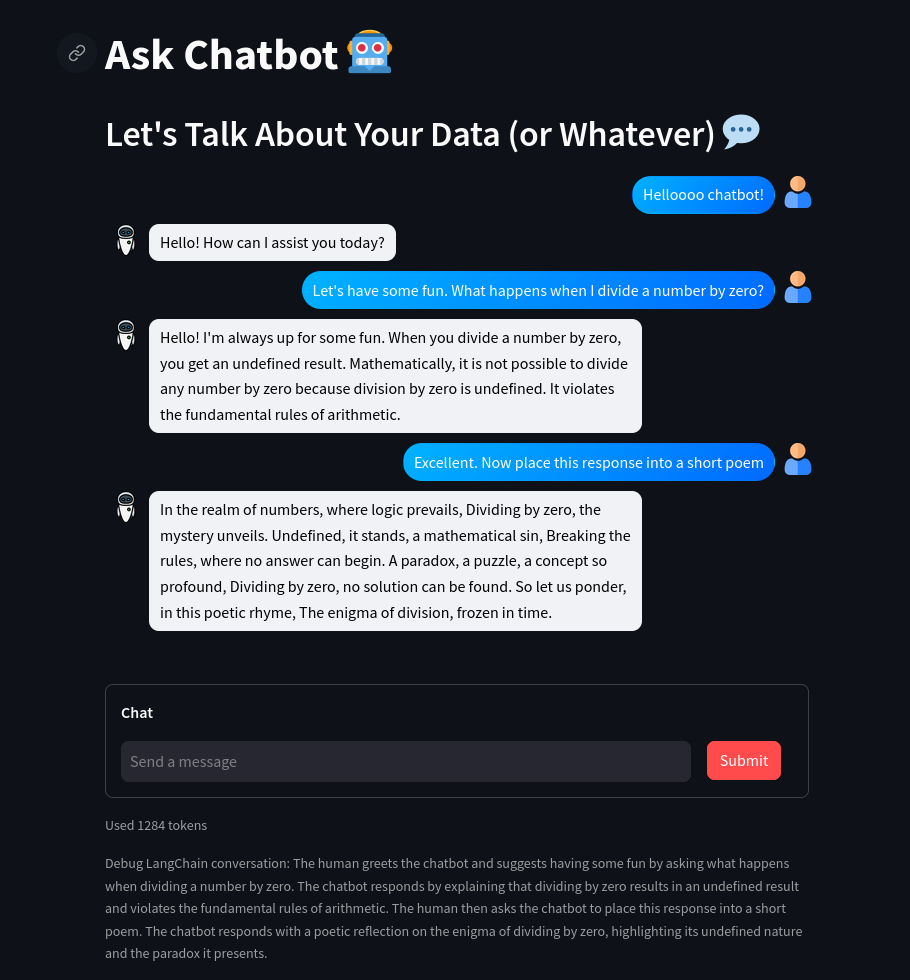

<div align="center">


# Ask Chatbot

Streamlit web app providing a Large Language Model (LLM) chatbot with a custom knowledge base


</div>

## Project Details

- Developed with Python version 3.10
- Streamlit
- LangChain
- OpenAI
- ChromaDB

## Getting Started

- Create a .streamlit folder in the 'src' directory and include the contents of the [.streamlit.example](src/.streamlit.example)

- To initialize a virtual enviroment, navigate to the 'src' directory in the terminal and execute

  ```
  $ python -m venv venv
  ```

- Activate the virtual environment, on MacOS or Linux with

  ```
  $ source venv/bin/activate
  ```

- Install dependencies

  ```
  $ pip install -r requirements.txt
  ```

- Run the app

  ```
  $ streamlit run app.py
  ```

  Open your browser at http://localhost:8501

- To deactivate the virtual environment

  ```
  $ deactivate
  ```

<div align="center">

|                    LLM Conversation                     |
| :-----------------------------------------------------: |
|  |

</div>